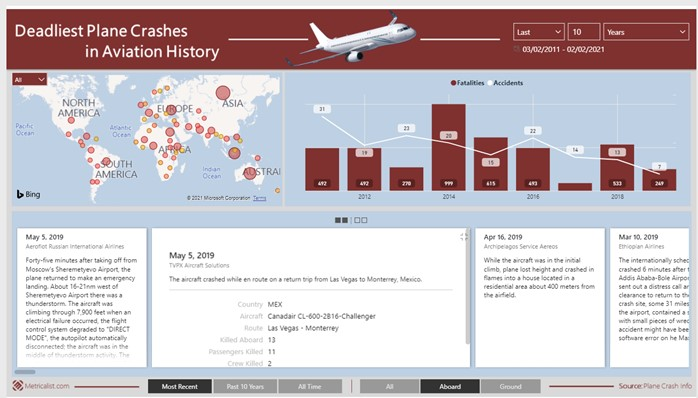

# Monthly Objective - February 2021 - Understanding of Visualisation Techniques

## Objective

This monthly task is to look at improving my understanding of visualisation techniques.

I will improve my understanding of visualisation techniques by:

- Going to the PowerBI Gallery.

[https://community.powerbi.com/t5/Data-Stories-Gallery/bd-p/DataStoriesGallery](https://community.powerbi.com/t5/Data-Stories-Gallery/bd-p/DataStoriesGallery) and choosing an interesting visualisation:

- Find three interesting facts or insights.
- What makes this an effective visualisation?
- What would you like to change?
- sharing my thoughts with my accountability partner.

I will demonstrate I have achieved this by writing key reflections and uploading them as evidence.

## Submission

### PowerBI Gallery

Looking through the PowerBI online community gallery of Data Stories at [https://community.powerbi.com/t5/Data-Stories-Gallery/bd-p/DataStoriesGallery](https://community.powerbi.com/t5/Data-Stories-Gallery/bd-p/DataStoriesGallery)

I found a couple of interesting ones to look at, but although listed the data was no longer available. Lesson 1 is if you publish something, make sure its still available or remove it.

I chose the PowerBI dashboard of “Deadliest Plane Crashes in Aviation History” by Metricalist – Link Below.
[https://community.powerbi.com/t5/Data-Stories-Gallery/Deadliest-Plane-Crashes-in-Aviation-History-by-Metricalist/td-p/756965](https://community.powerbi.com/t5/Data-Stories-Gallery/Deadliest-Plane-Crashes-in-Aviation-History-by-Metricalist/td-p/756965)

### Find 3 interesting facts or insights

- 2001 saw the most fatalities through plane crashes with 4102 deaths.
- 1948 saw the most crashes with 74.
- Almost all regions in Africa and Europe have had a plane crash at some point in time.

What makes this an effective visualisation?

This is a simple visualisation and layout that displays location data, simple to read and understand the data.

### What would you like to change?

I think that this is strong visualisation using the standard PowerBI functionality. I would perhaps look to show the data in a different format visually using inspiration from [https://informationisbeautiful.net/](https://informationisbeautiful.net/) Maybe using plane fuselage to show the graph data on.
